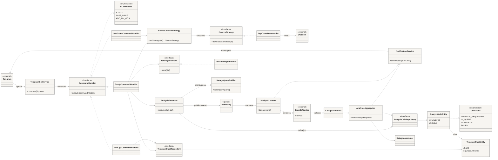

```mermaid
%%{init: {"theme": "base", "themeVariables": {"lineColor": "#a3a3a3", "primaryBorderColor": "#a3a3a3", "primaryColor": "#f7f5f1", "primaryTextColor": "#222222", "classText": "#222222", "edgeLabelBackground": "#ffffff"}}}%%
classDiagram
    direction LR

    class Telegram { <<external>> }
    class OGScom { <<external>> }
    class KataGoWorker { <<external>>
        RunPod
    }
    class RabbitMQ { <<queue>> }

    class ECommands { <<enumeration>>
        STUDY
        LAST_GAME
        ADD_MY_OGS
    }

    class JobStatus { <<enumeration>>
        ANALYSIS_REQUESTED
        IN_QUEUE
        COMPLETED
        FAILED
    }

    class TelegramBotService {
        +consume(Update)
    }

    class NotificationService {
        +sendMessageToChat()
    }

    class CommandHandler { <<interface>>
        +executeCommand(Update)
    }
    class StudyCommandHandler
    class LastGameCommandHandler
    class AddOgsCommandHandler

    class SourceContextStrategy {
        +setStrategy(url) ISourceStrategy
    }
    class ISourceStrategy { <<interface>>
        +downloadGameById(id)
    }
    class OgsGameDownloader

    class IStorageProvider { <<interface>>
        +store(file)
    }
    class LocalStorageProvider

    class TelegramChatEntity {
        chatId
        ogsAccountName
    }
    class AnalysisJobEntity {
        correlationId
        jobStatus
    }
    class TelegramChatRepository { <<interface>> }
    class AnalysisJobRepository { <<interface>> }

    class AnalysisProducer {
        +execute(chat, sgf)
    }
    class AnalysisListener {
        +listen(evento)
    }
    class KatagoQueryBuilder {
        +buildQuery(game)
    }
    class KatagoController
    class AnalysisAggregator {
        +handleResponse(resp)
    }
    class KatagoAssembler

    Telegram --> TelegramBotService : update
    TelegramBotService --> CommandHandler : despacha
    CommandHandler <|.. StudyCommandHandler
    CommandHandler <|.. LastGameCommandHandler
    CommandHandler <|.. AddOgsCommandHandler
    CommandHandler ..> ECommands

    StudyCommandHandler --> SourceContextStrategy
    LastGameCommandHandler --> SourceContextStrategy
    SourceContextStrategy --> ISourceStrategy : seleciona
    ISourceStrategy <|.. OgsGameDownloader
    OgsGameDownloader --> OGScom : REST

    StudyCommandHandler --> IStorageProvider
    IStorageProvider <|.. LocalStorageProvider

    StudyCommandHandler --> TelegramChatRepository
    AddOgsCommandHandler --> TelegramChatRepository
    TelegramChatRepository --> TelegramChatEntity
    AnalysisJobRepository --> AnalysisJobEntity
    AnalysisJobEntity --> TelegramChatEntity : chat
    AnalysisJobEntity ..> JobStatus

    StudyCommandHandler --> AnalysisProducer
    AnalysisProducer --> KatagoQueryBuilder : monta query
    AnalysisProducer --> RabbitMQ : publica evento
    AnalysisProducer --> AnalysisJobRepository : salva job
    RabbitMQ --> AnalysisListener : consome
    AnalysisListener --> KataGoWorker : consulta
    KataGoWorker --> KatagoController : callback
    KatagoController --> AnalysisAggregator
    AnalysisAggregator --> KatagoAssembler
    AnalysisAggregator --> AnalysisJobRepository
    AnalysisAggregator --> NotificationService
    AnalysisListener --> NotificationService
    NotificationService --> Telegram : mensagem

    classDef interfaceStyle fill:#dbeafe,stroke:#3b82f6,color:#1e3a8a
    classDef externalStyle fill:#f3f4f6,stroke:#9ca3af,color:#374151
    classDef queueStyle fill:#fde68a,stroke:#b45309,color:#78350f
    classDef enumStyle fill:#dcfce7,stroke:#16a34a,color:#14532d
    classDef entityStyle fill:#fae8ff,stroke:#a21caf,color:#581c87

    cssClass "CommandHandler, ISourceStrategy, IStorageProvider, TelegramChatRepository, AnalysisJobRepository" interfaceStyle
    cssClass "Telegram, OGScom, KataGoWorker" externalStyle
    cssClass "RabbitMQ" queueStyle
    cssClass "ECommands, JobStatus" enumStyle
    cssClass "TelegramChatEntity, AnalysisJobEntity" entityStyle
```
