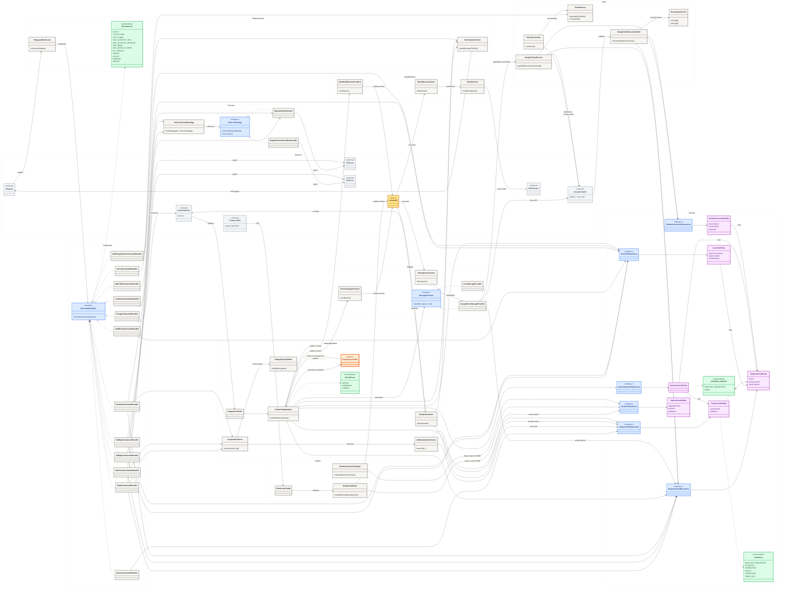

```mermaid
%%{init: {"theme": "base", "themeVariables": {"lineColor": "#404040", "primaryBorderColor": "#737373", "primaryColor": "#f7f5f1", "primaryTextColor": "#222222", "classText": "#222222", "edgeLabelBackground": "#ffffff"}}}%%
classDiagram
    direction LR

    namespace External {
        class Telegram { <<external>> }
        class OGScom { <<external>> }
        class DGScom { <<external>> }
        class KataGoWorker { <<external>>
            RunPod
        }
        class GoogleOAuth2 { <<external>>
            OAuth2 + Drive API
        }
        class SMTPServer { <<external>> }
        class PostgresWAL { <<external>>
            Logical replication
        }
        class RabbitMQ { <<queue>> }
    }

    namespace TelegramLayer {
        class ECommands { <<enumeration>>
            STUDY
            COLLECTION
            LAST_GAME
            ADD_ACCOUNT_OGS
            ADD_ACCOUNT_DRAGON
            ADD_EMAIL
            ADD_GOOGLE_DRIVE
            MY_PROFILE
            UNLINK
            QUEUE
            RANDOM
            RESIGN
        }
        class TelegramBotService {
            +consume(Update)
        }
        class NotificationService {
            +sendMessageToChat()
        }
    }

    namespace Commands {
        class ICommandHandler { <<interface>>
            +executeCommand(Update)
        }
        class StudyCommandHandler
        class LastGameCommandHandler
        class CollectionCommandHandler
        class RandomCommandHandler
        class AddOgsCommandHandler
        class AddDgsCommandHandler
        class AddEmailCommandHandler
        class AddGoogleDriveCommandHandler
        class MyProfileCommandHandler
        class UnlinkCommandHandler
        class QueueCommandHandler
        class ResignCommandHandler
    }

    namespace Sources {
        class SourceContextStrategy {
            +setStrategy(url) ISourceStrategy
        }
        class ISourceStrategy { <<interface>>
            +downloadGameById(id)
            +extractId(url)
        }
        class OgsGameDownloader
        class DragonServerGameDownloader
    }

    namespace Storage {
        class IStorageProvider { <<interface>>
            +store(file, phase, uuid)
        }
        class LocalStorageProvider
        class GoogleDriveStorageProvider
        class DriveStorageProducer {
            +send(event)
        }
        class DriveQueueListener {
            +listen(event)
        }
    }

    namespace EmailDelivery {
        class EmailNotificationProducer {
            +send(event)
        }
        class EmailQueueListener {
            +listen(event)
        }
        class EmailService {
            +sendEmail(event)
        }
    }

    namespace Auth {
        class TicketService {
            +generateUrl(chatId)
            +consume(id)
        }
        class OAuthController {
            +connect(id)
        }
        class GoogleAuthSuccesHandler {
            +onAuthenticationSuccess()
        }
        class GoogleTokenService {
            +getValidAccessToken(chatId)
        }
        class EncryptionService {
            +encrypt()
            +decrypt()
        }
    }

    namespace Domain {
        class TelegramChatEntity {
            chatId
            isDriveLinked
            driveFolderId
        }
        class UserInfoEntity {
            ogsAccountName
            dgsAccountId
            emailAddress
        }
        class AnalysisJobEntity {
            correlationId
            jobStatus
        }
        class GameAnalysisEntity
        class OAuthConnectionEntity {
            accessToken
            refreshToken
            expiresAt
        }
        class OutboxEventEntity {
            aggregateType
            payload
            published
        }
        class TelegramChatRepository { <<interface>> }
        class UserInfoRepository { <<interface>> }
        class AnalysisJobRepository { <<interface>> }
        class GameAnalysisRepository { <<interface>> }
        class OAuthConnectionRepository { <<interface>> }
        class OutboxRepository { <<interface>> }
        class JobStatus { <<enumeration>>
            ANALYSIS_REQUESTED
            IN_QUEUE
            COMPLETED
            FAILED
            CANCELLED
            TIMED_OUT
        }
        class OUTBOX_EVENTS { <<enumeration>>
            ANALYSIS_REQUESTED
            DONE
        }
    }

    namespace Outbox {
        class OutboxPublisher {
            +handleChangeEvent(evento)
        }
        class DebeziumConfig
        class OutboxCleanerScheduler {
            +cleanOutboxSentEvents()
        }
    }

    namespace AnalysisPipeline {
        class AnalysisProducer {
            +execute(chat, sgf)
        }
        class JobSubmissionService {
            +saveJob(...)
        }
        class AnalysisListener {
            +listen(evento)
        }
        class KatagoQueryBuilder {
            +buildQuery(game)
        }
        class KatagoController
        class AnalysisAggregator {
            +handleResponse(resp)
        }
        class KatagoAssembler { <<threads>> }
        class GamePhase { <<enumeration>>
            opening
            middlegame
            endgame
        }
    }

    Telegram --> TelegramBotService : update
    TelegramBotService --> ICommandHandler : despacha
    ICommandHandler <|.. StudyCommandHandler
    ICommandHandler <|.. LastGameCommandHandler
    ICommandHandler <|.. CollectionCommandHandler
    ICommandHandler <|.. RandomCommandHandler
    ICommandHandler <|.. AddOgsCommandHandler
    ICommandHandler <|.. AddDgsCommandHandler
    ICommandHandler <|.. AddEmailCommandHandler
    ICommandHandler <|.. AddGoogleDriveCommandHandler
    ICommandHandler <|.. MyProfileCommandHandler
    ICommandHandler <|.. UnlinkCommandHandler
    ICommandHandler <|.. QueueCommandHandler
    ICommandHandler <|.. ResignCommandHandler
    ICommandHandler ..> ECommands

    StudyCommandHandler --> SourceContextStrategy
    CollectionCommandHandler --> SourceContextStrategy
    LastGameCommandHandler --> OgsGameDownloader
    RandomCommandHandler --> OgsGameDownloader
    SourceContextStrategy --> ISourceStrategy : seleciona
    ISourceStrategy <|.. OgsGameDownloader
    ISourceStrategy <|.. DragonServerGameDownloader
    OgsGameDownloader --> OGScom : REST
    DragonServerGameDownloader --> DGScom : REST
    AddOgsCommandHandler --> OGScom : REST
    AddDgsCommandHandler --> DGScom : REST

    StudyCommandHandler --> TelegramChatRepository
    CollectionCommandHandler --> TelegramChatRepository
    RandomCommandHandler --> TelegramChatRepository
    AddOgsCommandHandler --> UserInfoRepository
    AddDgsCommandHandler --> UserInfoRepository
    AddEmailCommandHandler --> UserInfoRepository
    MyProfileCommandHandler --> UserInfoRepository
    UnlinkCommandHandler --> UserInfoRepository
    QueueCommandHandler --> AnalysisJobRepository
    AddGoogleDriveCommandHandler --> TicketService
    ResignCommandHandler --> KataGoWorker : cancela job

    TelegramChatRepository --> TelegramChatEntity
    UserInfoRepository --> UserInfoEntity
    UserInfoEntity --> TelegramChatEntity : chat
    AnalysisJobRepository --> AnalysisJobEntity
    AnalysisJobEntity --> TelegramChatEntity : chat
    AnalysisJobEntity ..> JobStatus
    GameAnalysisRepository --> GameAnalysisEntity
    GameAnalysisEntity --> AnalysisJobEntity : job
    GameAnalysisEntity --> TelegramChatEntity : chat
    OAuthConnectionRepository --> OAuthConnectionEntity
    OAuthConnectionEntity --> TelegramChatEntity : chat
    OutboxRepository --> OutboxEventEntity
    OutboxEventEntity ..> OUTBOX_EVENTS

    StudyCommandHandler --> AnalysisProducer
    CollectionCommandHandler --> AnalysisProducer
    RandomCommandHandler --> AnalysisProducer
    AnalysisProducer --> KatagoQueryBuilder : monta query
    AnalysisProducer --> JobSubmissionService : saveJob
    JobSubmissionService --> AnalysisJobRepository : salva job
    JobSubmissionService --> OutboxRepository : salva evento

    PostgresWAL --> DebeziumConfig : CDC
    DebeziumConfig --> OutboxPublisher : notifying
    OutboxPublisher --> RabbitMQ : publica evento
    OutboxPublisher --> OutboxRepository : marca como DONE
    OutboxCleanerScheduler --> OutboxRepository : limpa eventos DONE

    RabbitMQ --> AnalysisListener : consome
    AnalysisListener --> KataGoWorker : consulta
    AnalysisListener --> AnalysisJobRepository : atualiza status
    AnalysisListener --> NotificationService
    KataGoWorker --> KatagoController : callback
    KatagoController --> AnalysisAggregator
    AnalysisAggregator --> "3" KatagoAssembler : executa em paralelo
    KatagoAssembler --> AnalysisAggregator : retorna uma parte da analise
    AnalysisAggregator --> AnalysisJobRepository
    AnalysisAggregator --> TelegramChatRepository
    AnalysisAggregator --> GameAnalysisRepository
    AnalysisAggregator --> UserInfoRepository
    AnalysisAggregator --> IStorageProvider : armazena
    AnalysisAggregator --> NotificationService
    AnalysisAggregator --> EmailNotificationProducer : publica evento
    AnalysisAggregator --> DriveStorageProducer : publica evento
    AnalysisAggregator ..> GamePhase

    IStorageProvider <|.. LocalStorageProvider
    IStorageProvider <|.. GoogleDriveStorageProvider

    EmailNotificationProducer --> RabbitMQ : publica evento
    RabbitMQ --> EmailQueueListener : consome
    EmailQueueListener --> EmailService : sendEmail
    EmailService --> SMTPServer : envia email

    DriveStorageProducer --> RabbitMQ : publica evento
    RabbitMQ --> DriveQueueListener : consome
    DriveQueueListener --> GoogleDriveStorageProvider : uploadFile
    GoogleDriveStorageProvider --> GoogleTokenService : getValidAccessToken
    GoogleDriveStorageProvider --> GoogleOAuth2 : Drive API
    GoogleDriveStorageProvider --> TelegramChatRepository : driveFolderId

    AddGoogleDriveCommandHandler --> NotificationService
    OAuthController --> TicketService : consume(id)
    OAuthController --> GoogleOAuth2 : redireciona
    GoogleOAuth2 --> GoogleAuthSuccesHandler : callback
    GoogleAuthSuccesHandler --> OAuthConnectionRepository
    GoogleAuthSuccesHandler --> TelegramChatRepository
    GoogleAuthSuccesHandler --> EncryptionService : encrypt tokens
    GoogleTokenService --> OAuthConnectionRepository
    GoogleTokenService --> TelegramChatRepository
    GoogleTokenService --> GoogleOAuth2 : refresh token

    NotificationService --> Telegram : mensagem

    style ICommandHandler fill:#dbeafe,stroke:#3b82f6,color:#1e3a8a
    style ISourceStrategy fill:#dbeafe,stroke:#3b82f6,color:#1e3a8a
    style IStorageProvider fill:#dbeafe,stroke:#3b82f6,color:#1e3a8a
    style TelegramChatRepository fill:#dbeafe,stroke:#3b82f6,color:#1e3a8a
    style UserInfoRepository fill:#dbeafe,stroke:#3b82f6,color:#1e3a8a
    style AnalysisJobRepository fill:#dbeafe,stroke:#3b82f6,color:#1e3a8a
    style GameAnalysisRepository fill:#dbeafe,stroke:#3b82f6,color:#1e3a8a
    style OAuthConnectionRepository fill:#dbeafe,stroke:#3b82f6,color:#1e3a8a
    style OutboxRepository fill:#dbeafe,stroke:#3b82f6,color:#1e3a8a

    style Telegram fill:#f3f4f6,stroke:#9ca3af,color:#374151
    style OGScom fill:#f3f4f6,stroke:#9ca3af,color:#374151
    style DGScom fill:#f3f4f6,stroke:#9ca3af,color:#374151
    style KataGoWorker fill:#f3f4f6,stroke:#9ca3af,color:#374151
    style GoogleOAuth2 fill:#f3f4f6,stroke:#9ca3af,color:#374151
    style SMTPServer fill:#f3f4f6,stroke:#9ca3af,color:#374151
    style PostgresWAL fill:#f3f4f6,stroke:#9ca3af,color:#374151

    style RabbitMQ fill:#fde68a,stroke:#b45309,color:#78350f

    style ECommands fill:#dcfce7,stroke:#16a34a,color:#14532d
    style JobStatus fill:#dcfce7,stroke:#16a34a,color:#14532d
    style OUTBOX_EVENTS fill:#dcfce7,stroke:#16a34a,color:#14532d
    style GamePhase fill:#dcfce7,stroke:#16a34a,color:#14532d

    style TelegramChatEntity fill:#fae8ff,stroke:#a21caf,color:#581c87
    style UserInfoEntity fill:#fae8ff,stroke:#a21caf,color:#581c87
    style AnalysisJobEntity fill:#fae8ff,stroke:#a21caf,color:#581c87
    style GameAnalysisEntity fill:#fae8ff,stroke:#a21caf,color:#581c87
    style OAuthConnectionEntity fill:#fae8ff,stroke:#a21caf,color:#581c87
    style OutboxEventEntity fill:#fae8ff,stroke:#a21caf,color:#581c87

    style KatagoAssembler fill:#ffedd5,stroke:#ea580c,color:#9a3412,stroke-width:2px
```
